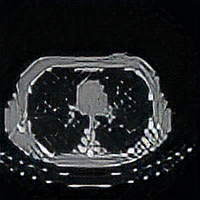
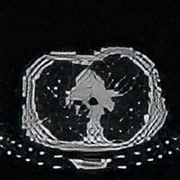
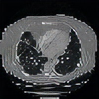

# CT-scan-classification

Project for <a href="https://www.kaggle.com/c/ai-unibuc-23-31-2021"> this </a> Kaggle competition.

## Description
This was a CT scan classification challenge for classifying computer tomography scans of lungs into 3 categories: native, arterial or venous. These are 3 contrast phases of a CT-scan that happen in a specific time interval.

<figure>
  
  <figcaption>native phase</figcaption>
</figure> 
<figure>
  
  <figcaption>arterial phase</figcaption>
</figure> 
<figure>
  
  <figcaption>venous phase</figcaption>
</figure> 

## Approach
My model got an accuracy of 79.726% and can be found <a href="https://github.com/stanbianca/CT-scan-classification/tree/main/Final%20submitted%20models"> here </a>.
